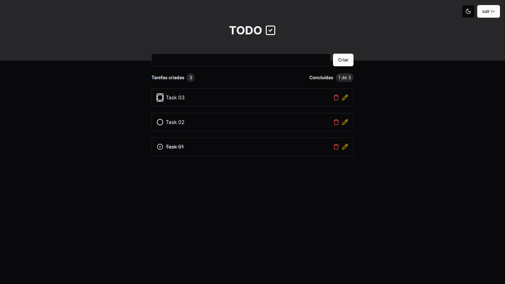

# Todo List Challenge

<p align="center">
   
</p>

## Desafio técnico

### Tarefa Backend:

- [x] Criar um novo usuário.
- [x] Efetuar autenticação jwt com este usuário e receber um token (Login).
- [x] Adicionar uma nova tarefa na to-do list (Rota protegida com autenticação).
- [x] Listar todas as tarefas da to-do list  (Rota protegida com autenticação).
- [x] Atualizar uma tarefa existente na to-do list  (Rota protegida com autenticação).
- [x] Excluir uma tarefa na to-do list  (Rota protegida com autenticação).

### Requisitos técnicos do backend:
- [x] Implementar as rotas usando Express/NestJS.
- [x] Armazenar as tarefas em um banco de dados (sqlite, mysql ou postgresql).
- [x] Escrever testes básicos para as funcionalidades implementadas.

### Tarefa Frontend:

- [x] Registrar um novo usuário: Um formulário para inserção de nome de usuário e senha, com botão para submeter os dados e criar o usuário na base de dados através da API.
- [x] Login: Um formulário onde o usuário possa inserir seu nome de usuário e senha, e ao submeter, receba um token JWT retornado pela API e armazene este token localmente para futuras requisições autenticadas.
- [x] Adicionar uma nova tarefa: Uma interface que permita inserir o título e descrição da tarefa. Esta operação deve ser protegida, exigindo que o usuário esteja autenticado.
- [x] Listar todas as tarefas: Uma página onde todas as tarefas do usuário logado sejam listadas. Esta operação deve ser protegida.
- [x] Atualizar uma tarefa existente: Opções para editar o título e descrição de uma tarefa já criada. Esta operação também deve ser protegida.
- [x] Excluir uma tarefa: Botões para deletar tarefas individuais, com uma confirmação antes de realizar a operação. Esta ação deve ser protegida.

### Requisitos técnicos do frontend:
- [x] Implementar a aplicação usando React.js ou NextJS.
- [x] Gerenciar o estado da aplicação de forma eficiente, utilizando Context API ou Redux.
- [x] Uso de Axios ou Fetch API para chamadas HTTP.
- [x] Implementar autenticação no cliente para manter o usuário logado e enviar o token JWT em requisições autenticadas.
- [x] Aplicar estilos de forma consistente e responsiva usando CSS puro, SASS ou frameworks CSS como TailwindCSS ou Bootstrap.

### Pré-requisitos para rodar o projeto

Antes de começar, você vai precisar ter instalado em sua máquina as seguintes ferramentas: Git, NodeJS e Docker/Docker-compose.

#### 🎲 Rodando o app

```bash
# Clone este repositório.
$ git clone git@github.com:JoaoManoelDev/todo-list-challenge.git

# Vamos começar configurando o back-end da aplicação.
# Acesse a pasta do projeto no terminal/cmd.
$ cd todo-list-challenge/back-end

# Instale as dependências
$ npm install

# Para o back-end funcionar ele precisa de duas variáveis de ambiente: JWT_SECRET e DATABASE_URL.
# As mesmas se encontram no arquivo .env.example já preenchidas para facilitar.
# Basta criar um arquvio .env na pastar raiz back-end e colar essas variáveis.

# No back-end está sendo utilizado o postgress rodando em um conainer docker.
# Para facilitar o docker-compose já está configurado no arquivo docker-compose.yml.
# Suba o banco de dados com o dokcer usando docker compose.
$ docker compose up -d

# Em seguida, rode as migrations do prisma.
$ npx prisma migrate dev

# Por fim suba o servidor back-end.
$ npm run dev

O servidor vai estar rondando na porta 3333 - acesse http://localhost:3333.

------------

# Agora vamos configurar o front-end da aplicação.
# Acesse a pasta do projeto no terminal/cmd.
$ cd todo-list-challenge/front-end

# Instale as dependências.
$ npm install

# Faça o build da aplicação.
$ npm run build

# Por fim suba a aplicação front-end.
$ npm run start

A aplicação vai estar rondando na porta 3000 - acesse http://localhost:3000.

# Você também pode rodar a aplicação em modo desenvolvedor.
$ npm run dev

```

Ao acessar a aplicação, vá em 'Registrar' na parte superior direita do
aplicativo. Após se registrar, você será redirecionado para a página de
login, onde seu e-mail já estará preenchido. Basta inserir sua senha.

Feito por João Manoel
